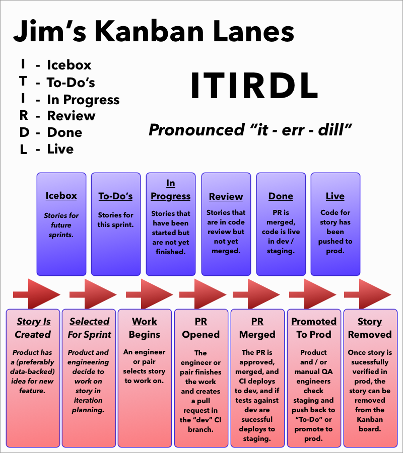

# Jims-Kanban-Lanes
This repo contains the artwork files for My Kanban Lanes poster: 

 

## Motivation

A bunch of teams at my client company were having trouble agreeing on a common structure for the lanes of our Jira kanban boards. I wasn't involved in the meeting, but I thought it would be an interesting exercise for me as an engineer unbiased by the meeting to come up with my own kanban lanes.

Also, this was an oppotunity to sharpen my designer skills in sketch which, as you can see, aren't incredibly strong. 😁

## Pronunciation
The correct pronunciation is similar to how Larry the Cable Guy says "git 'err doneeee". When celebrating how much you enjoy living this kanbonian lifestyle, you may exclaim "ITRDL" with a sound that reads like, "iiit errrr diiiiilllll"! 
